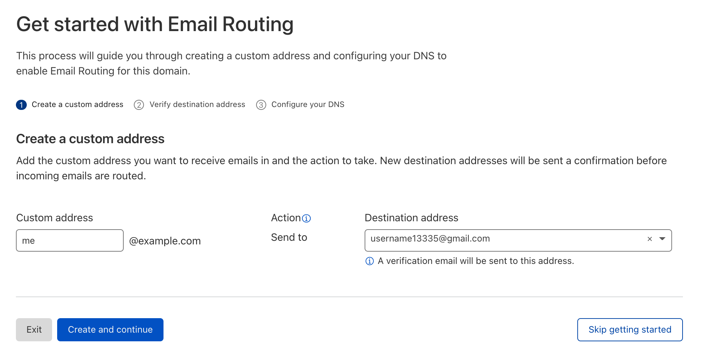
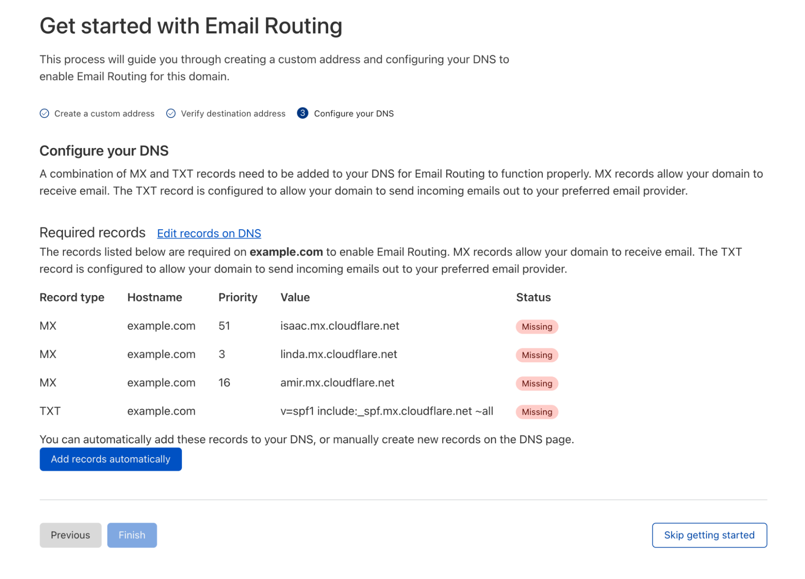

# Use a custom Domain as your Email Address using Gmail

## Email forwarding to Gmail

1. Log in to your Cloudflare Dashboard and select your zone and click "Email" in the left navigation panel.

1. Create a custom email address or your domain (in my case me@example.com) then type in the destination email address (your Gmail address - in my case, username13335@gmail.com).

1. This step will trigger sending a confirmation email to username13335@gmail.com so that they can prove that the destination Inbox is yours. You need to open Gmail and press the verification link.

1. Then, in the last step, you need to configure your zone MX and SPF DNS records. They will do this automatically for you. Just press "Add records automatically".

That’s it, Email Routing is now configured, and you can start sending emails to me@example.com and read them at username13335@gmail.com in Gmail.

All credits to: [paulonteri](https://paulonteri.com/thoughts/how-to/custom-domain-with-gmail)