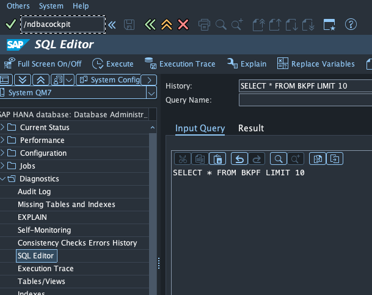
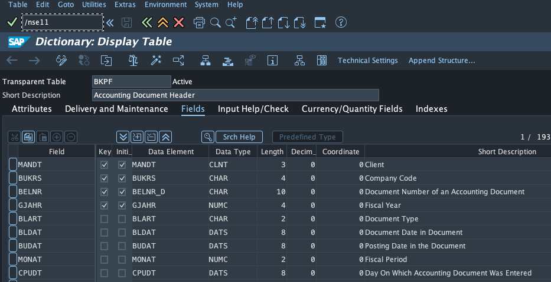
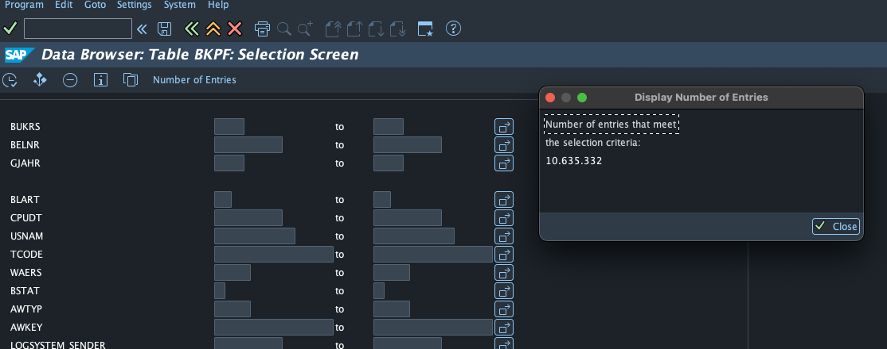

# Important Transactions

Always use `/n` as a prefix of a transaction to ensure it opens in a new window.

- `/ndbacockpit` opens the dbacockpit where the SQL editor can be used
  
- `/nse11` opens the Abap Dictionary. Enter a table name to find out the columns
  
- ` /nse16` opens the Data Browser. When entering a table name and click on "Table Contents" and afterwards "Number of Entries" it displays the amount of rows for the table
  